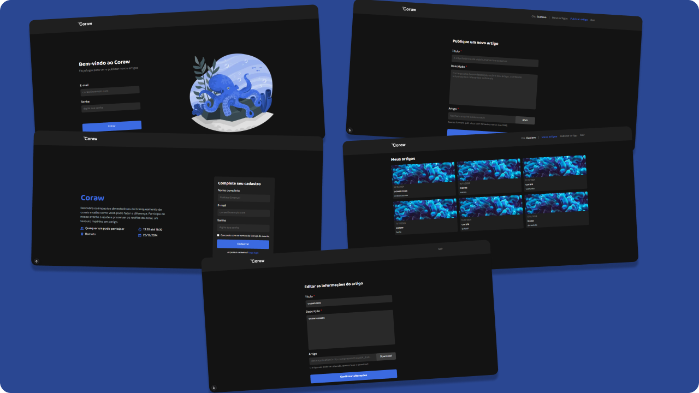

# 🪸 Coraw

Coraw é um sistema web responsável pelo gerenciamento de um evento científico que aborda o branqueamento de corais, desenvolvido em NextJS + TypeScript. Ele facilita a organização e a gestão do evento, proporcionando uma plataforma eficiente tanto para os participantes quanto para os administradores.



## 🚀 Funcionalidades

- **Cadastro de Usuários**: Qualquer usuário pode se cadastrar no evento inserindo seu nome, email e senha.
- **Login**: A partir dos dados cadastrados no json-server, os usuários e o administrador poderão fazer login com suas credenciais.
- **Publicar Artigo**: Após entrar no sistema, será possível publicar um artigo, informando o nome, descrição e inserindo o arquivo. E na página de artigos, será mostrado todos os artigos publicados.
- **Dashboard Admin**: Após o admin entrar no sistema, será possível ver uma tabela de artigos publicados e outra tabela de usuários cadastrados, onde administrador poderá gerenciar tudo.
- **Tabela de Artigos**: O admin poderá editar as informações, fazer o download e excluir os artigos.
- **Tabela de Usuários**: O admin poderá excluir usuários. 

## 📝 Bibliotecas

- **React-Hook-Form e Zod**: Usados para validação dos formulários de cadastro.
- **Stitches**: Usado para estilização de componentes (semelhante ao Styled-Components).
- **React-Icons**: Responsável pelos ícones do sistema.
- **Cloudinary**: Responsável por gerar o link de imagens enviadas nos artigos.
- **JSON-Server**: Responsável por guardar as informações de usuários e administrador.
- **Axios**: Usado para acessar a tabela de usuários e administrador.
- **Radix-UI**: Usado para criação do modal de excluir artigo e usuário.
- **Nookies**: Gerencia os cookies da aplicação.

## 🎨 Figma

Acesse o link do Figma, a base do Coraw:

<a href="https://www.figma.com/design/yF9ZXJrc7g2WXr43WSGRfs/Branqueamento-de-Corais?node-id=0-1&node-type=canvas&t=XHPewIPXynAGkdqD-0" target="_blank">Link do Coraw</a>

## 🖥️ Como rodar o projeto

Faça clone do projeto.
```tsx
git clone https://github.com/GustavoeDev/coraw.git
````

Baixe as dependências
```tsx
npm install
````

Inicialize o JSON-Server
```tsx
npm run dev:server
````

Inicialize o projeto
```tsx
npm run dev
````
